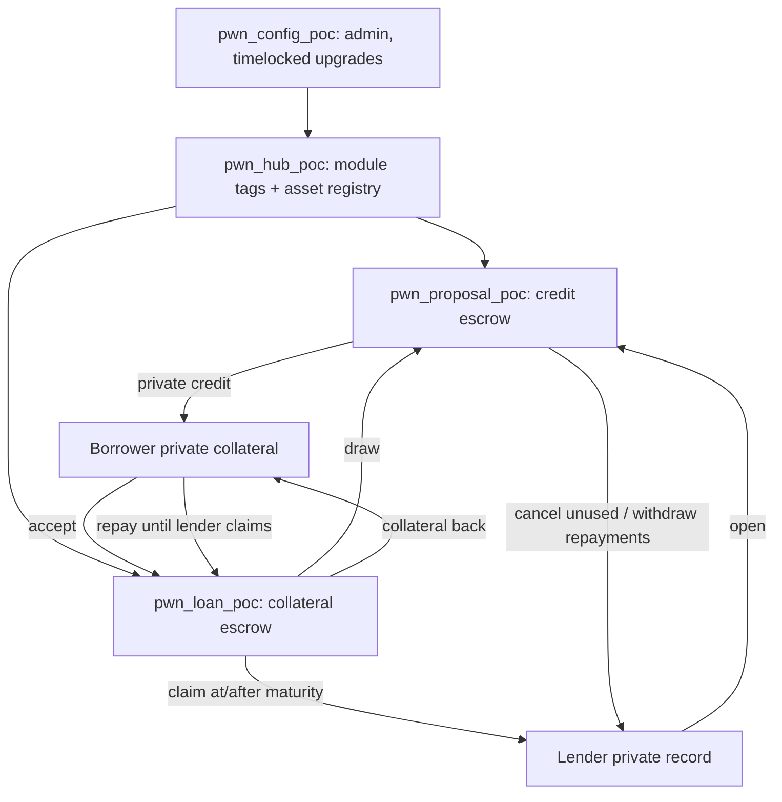

# PWN private fixed-term loan — Aleo PoC

Leo 4.4.2. One lender funds an Elastic Proposal once; borrowers draw
independently; fixed-term repayment or default. Native ALEO, ARC-20 and the
deployed USDCx/USAD compliance ABI in either role. No frontend, SDK,
installments, pooling or oracle.

Programs: `pwn_config_poc`, `pwn_hub_poc`, `pwn_proposal_poc`, `pwn_loan_poc`
(generated, local devnode only; the `_poc` suffix is interim — shorter names
carry a namespace premium). Design: [MULTITOKEN.md](MULTITOKEN.md).



Programs own **public** balances; nested calls debit the immediate caller
program. Private records always belong to a person.

## Run

```sh
make setup      # pinned Leo 4.4.2 into .tools/leo
make build      # regenerate + compile
make check      # unit, compatibility, fuzz, test, invariants, security
```

Individual suites and scope: [docs/TESTING.md](docs/TESTING.md). Generated
`pwn_*/src/main.leo` must not be edited by hand.

## Lifecycle

1. Admin: `initialize`, `set_tag` for proposal/loan, `set_asset` per token.
2. Lender: `open_<family>(nonce, terms, record, amount, salt)` → escrow.
3. Borrower: `accept_<credit>_<collateral>(nonce, commitment, terms, amount, collateral, salt)` → collateral locked, private credit delivered atomically.
4. Borrower: `repay_<credit>_<collateral>` while the loan is active (also after maturity, until the lender claims) → collateral back.
5. Lender: `claim_<collateral>` at/after maturity; `withdraw_<family>` repayments; `cancel_<family>` unused credit.

Use a fresh random salt per position and private fees.

## Documents

- [MULTITOKEN.md](MULTITOKEN.md) — design, families, terms, reserve guard, governance, tests
- [SECURITY-REVIEW.md](SECURITY-REVIEW.md) — what holds, open risks (SEC-01 issuer powers)
- [INTERFACES.md](INTERFACES.md) — decisions pending PWN agreement
- [PRIVACY.md](PRIVACY.md) — disclosure matrix, salts, fees
- [archive/](archive/README.md) — Milestone 1 material from the single-pair predecessor (public-testnet deployment, reports, scripts, artifacts); not maintained
- [research/](research/SEMANTICS.md), [vendor/README.md](vendor/README.md) — semantics notes, token bytecode provenance

`custody_probe`, `usdcx_composition_probe`, `artifacts/token-dispatch-probe`: compile-only experiments, never funded.
